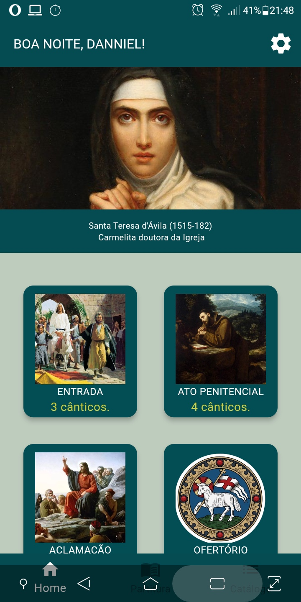
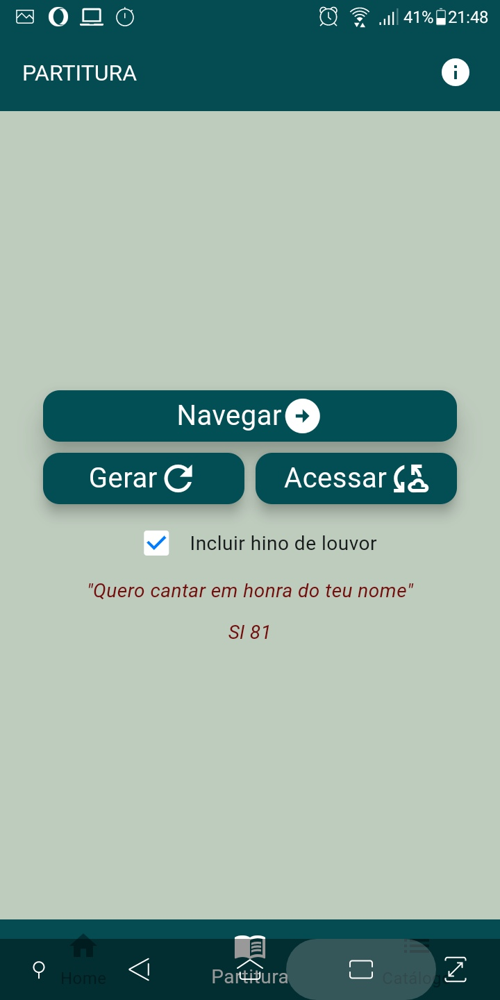
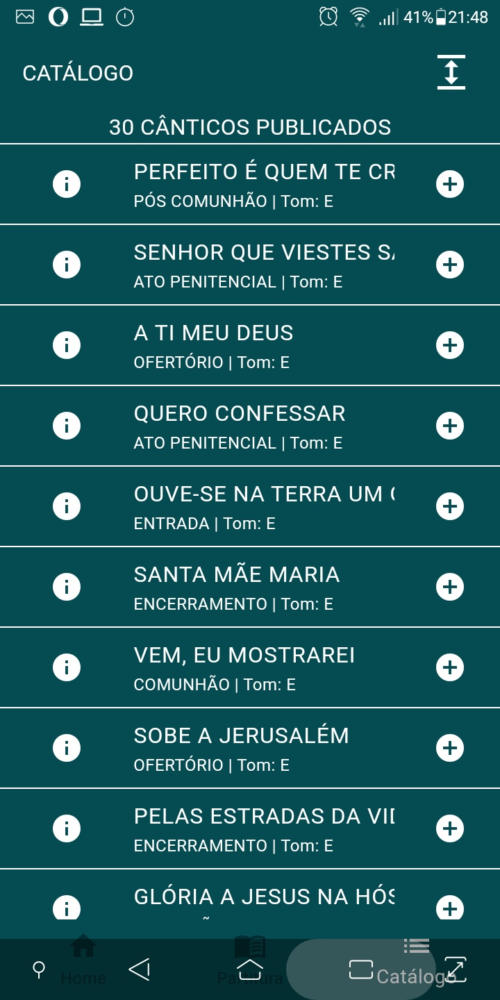
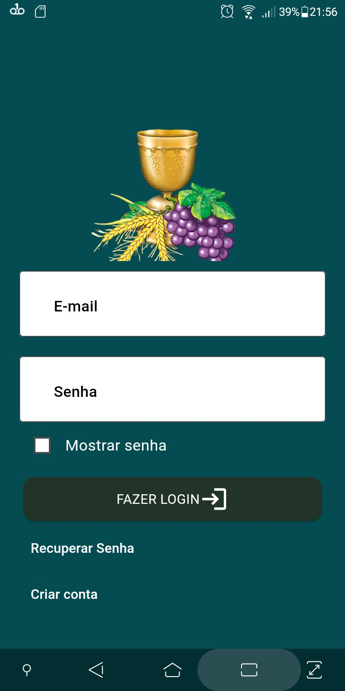
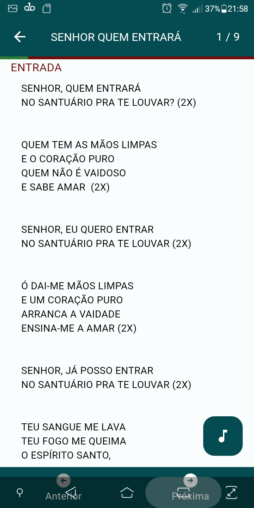
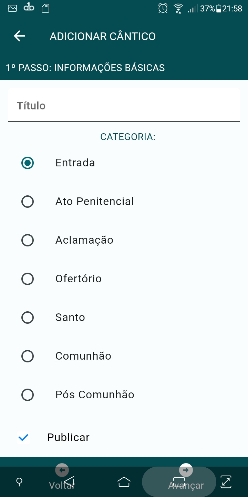
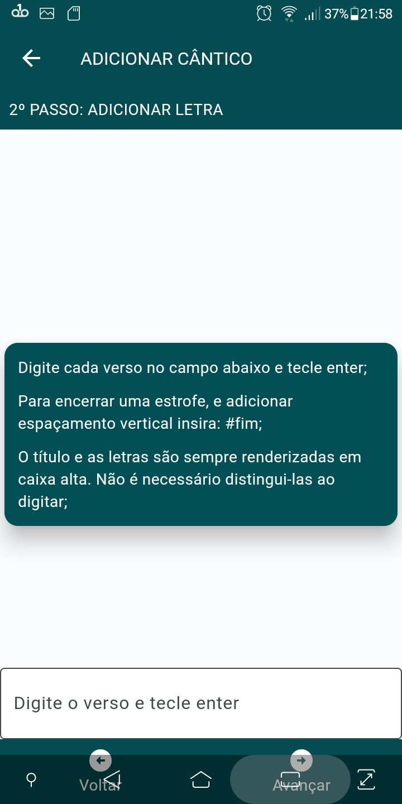

#Pt-BR

Versão evoluída e finalizada da aplicação armazenada em: github.com/ddiasguto/mliturgica. 
Nessa versão, os usuários podem criar suas contas e enviarem seus próprios cânticos a fim de compartilharem com outros membros de sua respectiva equipe de canto. 

Uma vez que tal projeto não teve adesão da comunidade católica de Formosa-GO, o projeto no 
Firebase foi deletado e o código está agora público sob a licença MIT.

#EN

Evolved and finalized version of the application stored at: github.com/ddiasguto/mliturgica.
In this version, users can create their accounts and submit their own chants to share with other members of their respective singing teams.

As this project did not gain traction within the Catholic community of Formosa-GO, the Firebase project has been deleted, and the code is now publicly available under the MIT license.

